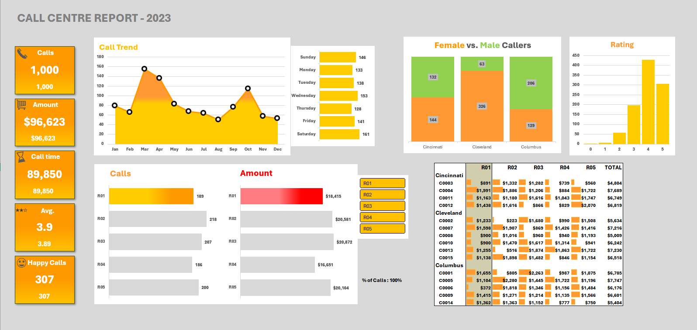

# 📞 Call Center Analytics Dashboard – Excel Portfolio Project

Welcome to a business-ready Excel analytics project that turns raw call center data into a powerful and interactive dashboard. Built entirely in Microsoft Excel, this project showcases data wrangling and visualization techniques using Power Query, Pivot Tables, and KPIs.

---

## 🧾 Project Summary

This dashboard was built using real-style call center operational data, containing over 90 rows of customer interactions across cities, agents, and time. The purpose of this project is to derive **agent performance metrics**, **customer satisfaction insights**, and **call traffic trends**, all within Excel.

### 🔄 Input File:
- **Call_Center_Data.csv** in `/data/`
- Contains: `Date`, `City`, `Customer ID`, `Agent`, `Duration`, `Amount`, `Gender`, `Rating`, `Resolved Status`

### 🛠️ Built With:
- **Microsoft Excel 365**
- **Power Query** for ETL (cleaning, formatting)
- **Pivot Tables & Charts** for summarization
- **Slicers** for dynamic filtering by agent
- **Conditional Formatting** for data bars and icon sets

---

## 🧠 Key Metrics Calculated

| KPI | Description |
|-----|-------------|
| 📞 **Total Calls** | 1,000 total interactions logged |
| ⏱️ **Call Duration** | Total & avg. time across agents |
| 💰 **Revenue (Amount)** | Total and per-agent billing |
| 😊 **Happy Calls** | Based on rating ≥ 4 |
| 🌟 **Average Rating** | Customer feedback aggregation |
| 👨‍🦰 vs 👩 **Gender Distribution** | Across cities |
| 📈 **Call Trend** | Monthly call volume over time |
| 🏆 **Top Agent** | R03 with highest revenue: $20,872 |

---

## 📊 Dashboard Overview

The dashboard provides a holistic view of call center operations, with:

- 📅 **Call trend** by month (line & area chart)
- 📋 **KPIs**: calls, amount, duration, rating
- 📍 **City-wise gender breakdown**
- 🧍 **Agent-wise performance** (calls & revenue)
- 🕔 **Weekday call activity**
- ⭐ **Rating frequency**
- 📌 **Agent-wise ranking table**
- 🎯 **Slicer** to filter by agent and compare metrics



---

## 📁 Folder Structure

```
Call-Center-Analytics-Dashboard/
├── data/
│   └── Call_Center_Data.csv
├── dashboard/
│   └── Call_Centre_Portfolio_Utkarsh.xlsx
├── screenshots/
│   └── dashboard_overview.png
├── docs/
│   └── Project_Report.pdf (optional)
├── .gitignore
├── README.md
└── LICENSE (optional)
```

---

## 🚀 How to Run This Project

1. Download or clone the repository.
2. Open `dashboard/Call_Centre_Portfolio_Utkarsh.xlsx` in Excel.
3. Use the **slicer** to filter by Agent ID (R01–R05).
4. To update data:
   - Replace the CSV in `/data/`
   - Use **Power Query > Refresh All** in Excel

---

## 💡 Insights Gained

- **Agent R03** leads in total amount collected and call handling.
- **Cleveland** handles the most male callers.
- **Monday** is the busiest day; **Wednesday** has peak calls.
- **Customer satisfaction** is centered around rating 4.
- High-value customers are spread across all cities and agents.

---

## 🔎 Why This Project Matters

✅ **Real-world business relevance**  
✅ **No-code analytics using Excel stack**  
✅ **Dynamic & interactive user experience**  
✅ **Visually compelling and recruiter-ready**

This project proves the ability to extract value from raw data and communicate it visually for decision-makers, all using Excel — a skill crucial in many analyst and BI roles.

---

## 📜 License

This project is licensed under the MIT License.

---

## 👋 Connect with Me

📧 Email: your.email@example.com  
🔗 LinkedIn: [linkedin.com/in/utkarsh](#)  
🌐 Portfolio: [Your Portfolio Link](#)
